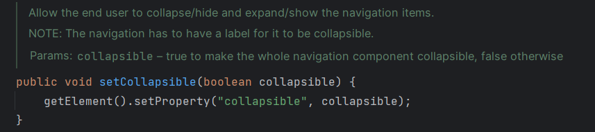
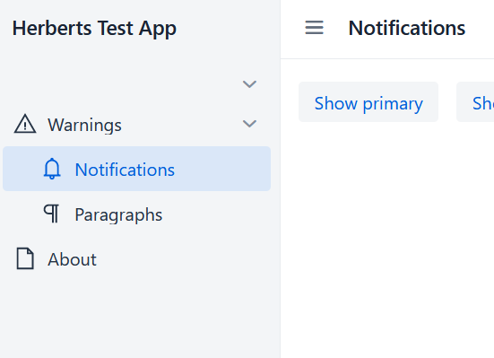

# hackathon-24-1

## Tested:
* Notification Variants (new warning variant)
* Paragraphs with new lumo colors (new warning color)
* SideNav configuration
  * Collapsible
  * Not navigatable, but expandable side nav item (Warnings)
  * Navigatable and expandable side nav item (Other)
  * External link
  * Just some info text

## Bugs found / Missing features:
* Collapsible SideNav  
https://github.com/vaadin/flow-components/issues/5090

when setting collapsible without label falls apart

Clicking on the collapse icon, doesn't do anything. 
* SideNavItem with external link. There's no API to make it open in a new tab.
  https://github.com/vaadin/flow-components/issues/5091