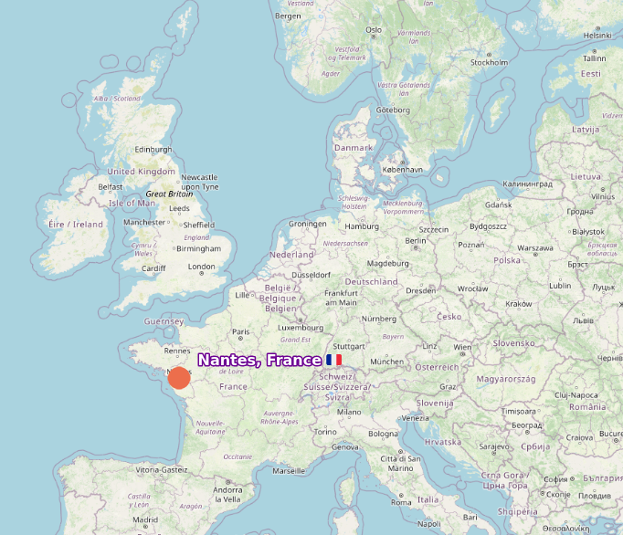

# Viaggiare

> **Note**
> An OpenWeatherMap API key is needed to use this example. I'll provide one in Slack or you can get one for free at https://openweathermap.org/api.

This application tests marker drag and drop and marker styling in Vaadin Maps.

All you have to do is to drag the marker and drop anywhere on the map. The application will then show the weather icon and the name of the place where you dropped the marker.

The marker label will contain the city (if found), the country name and the country flag.

The text color of the marker label will change depending on the latitude of the dropped marker.

The APIs used have request limits, so you may get an error message if you try to drag the marker too many times.

I didn't clean up the code, it is just how it came out of the box. Also, I have to greet ChatGPT for the help in the development of this little example.

## Running the application

The project is a standard Maven project. To run it from the command line,
type `mvnw` (Windows), or `./mvnw` (Mac & Linux), then open
http://localhost:8080 in your browser.

You can also import the project to your IDE of choice as you would with any
Maven project. Read more on [how to import Vaadin projects to different IDEs](https://vaadin.com/docs/latest/guide/step-by-step/importing) (Eclipse, IntelliJ IDEA, NetBeans, and VS Code).

## Deploying to Production

To create a production build, call `mvnw clean package -Pproduction` (Windows),
or `./mvnw clean package -Pproduction` (Mac & Linux).
This will build a JAR file with all the dependencies and front-end resources,
ready to be deployed. The file can be found in the `target` folder after the build completes.

Once the JAR file is built, you can run it using
`java -jar target/viaggiare-1.0-SNAPSHOT.jar`

## Project structure

- `MainLayout.java` in `src/main/java` contains the navigation setup (i.e., the
  side/top bar and the main menu). This setup uses
  [App Layout](https://vaadin.com/docs/components/app-layout).
- `views` package in `src/main/java` contains the server-side Java views of your application.
- `views` folder in `frontend/` contains the client-side JavaScript views of your application.
- `themes` folder in `frontend/` contains the custom CSS styles.

## Useful links

- Read the documentation at [vaadin.com/docs](https://vaadin.com/docs).
- Follow the tutorial at [vaadin.com/docs/latest/tutorial/overview](https://vaadin.com/docs/latest/tutorial/overview).
- Create new projects at [start.vaadin.com](https://start.vaadin.com/).
- Search UI components and their usage examples at [vaadin.com/docs/latest/components](https://vaadin.com/docs/latest/components).
- View use case applications that demonstrate Vaadin capabilities at [vaadin.com/examples-and-demos](https://vaadin.com/examples-and-demos).
- Build any UI without custom CSS by discovering Vaadin's set of [CSS utility classes](https://vaadin.com/docs/styling/lumo/utility-classes). 
- Find a collection of solutions to common use cases at [cookbook.vaadin.com](https://cookbook.vaadin.com/).
- Find add-ons at [vaadin.com/directory](https://vaadin.com/directory).
- Ask questions on [Stack Overflow](https://stackoverflow.com/questions/tagged/vaadin) or join our [Discord channel](https://discord.gg/MYFq5RTbBn).
- Report issues, create pull requests in [GitHub](https://github.com/vaadin).
