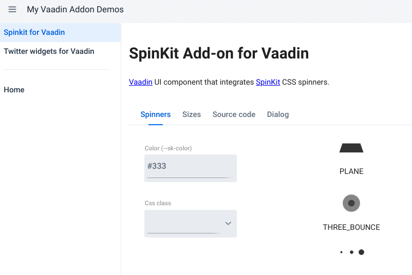

# hackathon-24-1

* [Hilla DX test](hilla-dx-test.md)
* Tested personal add-ons with Vaadin 24.1.0.beta2
    * No code changes required
    * Tested `vaadin.frontend.hotdeploy.dependencies` feature, to reload
      resources in different maven modules. Works great
* Updated add-ons demo project to 24.1.0.beta2
    * https://mbf-vaadin-addons.up.railway.app/
    * Added SideNav for navigation
      Got same issue as the one reported by
      Martin https://github.com/vaadin/flow/issues/16887

          2023-05-26T14:26:56.237+02:00 ERROR 66386 --- [nio-8080-exec-2] c.v.flow.component.internal.UIInternals  : The component class com.vaadin.flow.component.sidenav.SideNav includes '@vaadin/side-nav/src/vaadin-side-nav.js' but this file was not included when creating the production bundle. The component will not work properly. Check that you have a reference to the component and that you are not using it only through reflection. If needed add a @Uses(SideNav.class) where it is used.

Add-ons demo screenshot

