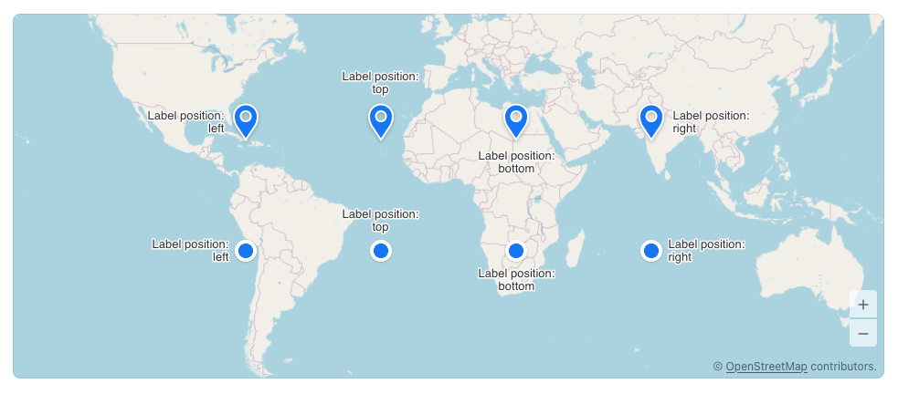

# Map Marker Text Positioning Helper

A small helper class for easily positioning marker texts to either the left, right, top or bottom of the marker icon.
The helper respects the icon's anchor point, as well as its size and scale.

This is something that came up as missing during the DX tests, so I wanted to see how difficult it would be to get this implemented.
See `src/main/java/de/sissbruecker/markertexthelper/MarkerTextHelper.java` for the implementation.

## Running the application

The project is a standard Maven project. To run it from the command line,
type `mvnw` (Windows), or `./mvnw` (Mac & Linux), then open
http://localhost:8080 in your browser.

You can also import the project to your IDE of choice as you would with any
Maven project. Read more on [how to import Vaadin projects to different IDEs](https://vaadin.com/docs/latest/guide/step-by-step/importing) (Eclipse, IntelliJ IDEA, NetBeans, and VS Code).
