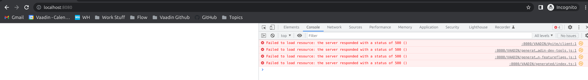
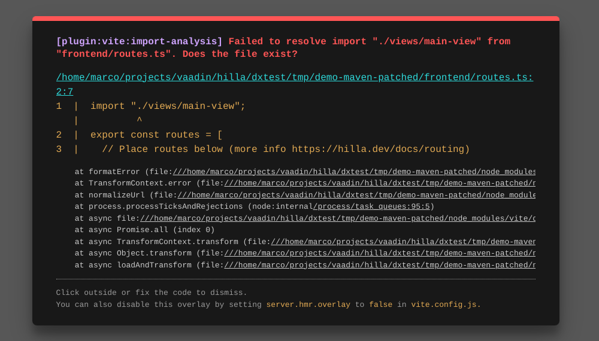

# Hilla DX test with Maven

- Unzip demo project and opened on the IDE
- Start project
  - takes long time (~2 minutes), as correctly pointed out in the documentation
  - no updates shown on server log, browser show build in progress

        2023-05-26T10:09:47.391+02:00  INFO 26146 --- [  restartedMain] c.e.demo.maven.DemoMavenApplication      : Started DemoMavenApplication in 2.867 seconds (process running for 3.057)
        2023-05-26T10:09:47.605+02:00  INFO 26146 --- [onPool-worker-1] c.v.f.s.frontend.TaskUpdatePackages      : using '/home/marco/.nvm/versions/node/v18.12.1/bin/npm --no-update-notifier --no-audit --scripts-prepend-node-path=true --ignore-scripts install' for frontend package installation
        2023-05-26T10:09:47.605+02:00  WARN 26146 --- [onPool-worker-1] c.v.f.s.frontend.TaskUpdatePackages      : package-lock.json is missing from this project. This may cause the npm package installation to take several minutes. It is recommended to keep the package-lock.json file persistently in your project. Please stand by...
        2023-05-26T10:10:57.592+02:00  INFO 26146 --- [nio-8080-exec-1] o.a.c.c.C.[Tomcat].[localhost].[/]       : Initializing Spring DispatcherServlet 'dispatcherServlet'
        2023-05-26T10:10:57.593+02:00  INFO 26146 --- [nio-8080-exec-1] o.s.web.servlet.DispatcherServlet        : Initializing Servlet 'dispatcherServlet'
        2023-05-26T10:10:57.593+02:00  INFO 26146 --- [nio-8080-exec-1] o.s.web.servlet.DispatcherServlet        : Completed initialization in 0 ms
        2023-05-26T10:10:57.614+02:00  INFO 26146 --- [nio-8080-exec-1] c.vaadin.flow.spring.SpringInstantiator  : The number of beans implementing 'I18NProvider' is 0. Cannot use Spring beans for I18N, falling back to the default behavior
        2023-05-26T10:12:56.461+02:00  INFO 26146 --- [onPool-worker-1] c.v.f.s.frontend.TaskUpdatePackages      : Frontend dependencies resolved successfully.
        2023-05-26T10:12:56.904+02:00  INFO 26146 --- [onPool-worker-1] d.h.internal.TaskGenerateOpenAPIImpl     : Configure Hilla engine using build system plugin
        2023-05-26T10:12:58.407+02:00  INFO 26146 --- [onPool-worker-1] dev.hilla.parser.core.Parser             : JVM Parser started
        2023-05-26T10:12:58.413+02:00  INFO 26146 --- [onPool-worker-1] dev.hilla.parser.core.Parser             : Search for endpoints in directories [/home/marco/projects/vaadin/hilla/dxtest/demo-maven-patched/target/classes]
        2023-05-26T10:12:58.439+02:00  INFO 26146 --- [onPool-worker-1] dev.hilla.parser.core.Parser             : JVM Parser finished successfully
        INFO (tsgen): Output directory: /home/marco/projects/vaadin/hilla/dxtest/demo-maven-patched/frontend/generated
        INFO (tsgen): Plugins: BackbonePlugin, ClientPlugin, BarrelPlugin, ModelPlugin, PushPlugin
        INFO (tsgen) <BarrelPlugin>: Generating 'endpoints.ts' file
        2023-05-26T10:12:58.828+02:00  INFO 26146 --- [onPool-worker-1] c.v.f.s.frontend.TaskCopyFrontendFiles   : Copying frontend resources from jar files ...
        2023-05-26T10:12:58.838+02:00  INFO 26146 --- [onPool-worker-1] c.v.f.s.frontend.TaskCopyFrontendFiles   : Visited 4 resources. Took 9 ms.
        2023-05-26T10:12:58.850+02:00  INFO 26146 --- [onPool-worker-4] c.v.b.devserver.AbstractDevServerRunner  : Starting Vite
        
        ------------------ Starting Frontend compilation. ------------------
        2023-05-26T10:12:59.764+02:00  INFO 26146 --- [onPool-worker-4] c.v.b.devserver.AbstractDevServerRunner  : Running Vite to compile frontend resources. This may take a moment, please stand by...
        2023-05-26T10:13:00.079+02:00  INFO 26146 --- [   File Watcher] rtingClassPathChangeChangedEventListener : Restarting due to 1 class path change (1 addition, 0 deletions, 0 modifications)
        2023-05-26T10:13:00.082+02:00  INFO 26146 --- [       Thread-5] o.apache.catalina.core.StandardService   : Stopping service [Tomcat]
  - Application gets automatically restarted, but fails with `Connection refused` errors (2) and a blank page with HTTP 500 errors in console (3)
  
        java.net.ConnectException: Connection refused
        at java.base/sun.nio.ch.Net.pollConnect(Native Method) ~[na:na]
        at java.base/sun.nio.ch.Net.pollConnectNow(Net.java:672) ~[na:na]
        at java.base/sun.nio.ch.NioSocketImpl.timedFinishConnect(NioSocketImpl.java:542) ~[na:na]
        at java.base/sun.nio.ch.NioSocketImpl.connect(NioSocketImpl.java:597) ~[na:na]
        at java.base/java.net.Socket.connect(Socket.java:633) ~[na:na]
        at java.base/sun.net.NetworkClient.doConnect(NetworkClient.java:178) ~[na:na]
        at java.base/sun.net.www.http.HttpClient.openServer(HttpClient.java:531) ~[na:na]
        at java.base/sun.net.www.http.HttpClient.openServer(HttpClient.java:636) ~[na:na]
        at java.base/sun.net.www.http.HttpClient.parseHTTPHeader(HttpClient.java:929) ~[na:na]
        at java.base/sun.net.www.http.HttpClient.parseHTTP(HttpClient.java:759) ~[na:na]
        at java.base/sun.net.www.protocol.http.HttpURLConnection.getInputStream0(HttpURLConnection.java:1688) ~[na:na]
        at java.base/sun.net.www.protocol.http.HttpURLConnection.getInputStream(HttpURLConnection.java:1589) ~[na:na]
        at java.base/java.net.HttpURLConnection.getResponseCode(HttpURLConnection.java:529) ~[na:na]
        at com.vaadin.base.devserver.AbstractDevServerRunner.serveDevModeRequest(AbstractDevServerRunner.java:713) ~[vaadin-dev-server-24.1.0.beta2.jar:na]
        at com.vaadin.flow.server.StaticFileServer.serveStaticResource(StaticFileServer.java:254) ~[flow-server-24.1.0.beta2.jar:24.1.0.beta2]
        at com.vaadin.flow.server.VaadinServlet.serveStaticOrWebJarRequest(VaadinServlet.java:430) ~[flow-server-24.1.0.beta2.jar:24.1.0.beta2]
        at com.vaadin.flow.server.VaadinServlet.service(VaadinServlet.java:385) ~[flow-server-24.1.0.beta2.jar:24.1.0.beta2]
        at com.vaadin.flow.spring.SpringServlet.service(SpringServlet.java:106) ~[vaadin-spring-24.1.0.beta2.jar:na]
        at jakarta.servlet.http.HttpServlet.service(HttpServlet.java:658) ~[tomcat-embed-core-10.1.8.jar:6.0]
        at org.apache.catalina.core.ApplicationFilterChain.internalDoFilter(ApplicationFilterChain.java:205) ~[tomcat-embed-core-10.1.8.jar:10.1.8]
        at org.apache.catalina.core.ApplicationFilterChain.doFilter(ApplicationFilterChain.java:149) ~[tomcat-embed-core-10.1.8.jar:10.1.8]
        at org.apache.catalina.core.ApplicationDispatcher.invoke(ApplicationDispatcher.java:642) ~[tomcat-embed-core-10.1.8.jar:10.1.8]
        at org.apache.catalina.core.ApplicationDispatcher.processRequest(ApplicationDispatcher.java:408) ~[tomcat-embed-core-10.1.8.jar:10.1.8]
        at org.apache.catalina.core.ApplicationDispatcher.doForward(ApplicationDispatcher.java:313) ~[tomcat-embed-core-10.1.8.jar:10.1.8]
        at org.apache.catalina.core.ApplicationDispatcher.forward(ApplicationDispatcher.java:277) ~[tomcat-embed-core-10.1.8.jar:10.1.8]
        at org.springframework.web.servlet.mvc.ServletForwardingController.handleRequestInternal(ServletForwardingController.java:141) ~[spring-webmvc-6.0.9.jar:6.0.9]
        at org.springframework.web.servlet.mvc.AbstractController.handleRequest(AbstractController.java:178) ~[spring-webmvc-6.0.9.jar:6.0.9]
        at org.springframework.web.servlet.mvc.SimpleControllerHandlerAdapter.handle(SimpleControllerHandlerAdapter.java:51) ~[spring-webmvc-6.0.9.jar:6.0.9]
        at org.springframework.web.servlet.DispatcherServlet.doDispatch(DispatcherServlet.java:1081) ~[spring-webmvc-6.0.9.jar:6.0.9]
        at org.springframework.web.servlet.DispatcherServlet.doService(DispatcherServlet.java:974) ~[spring-webmvc-6.0.9.jar:6.0.9]
        at org.springframework.web.servlet.FrameworkServlet.processRequest(FrameworkServlet.java:1011) ~[spring-webmvc-6.0.9.jar:6.0.9]
        at org.springframework.web.servlet.FrameworkServlet.doGet(FrameworkServlet.java:903) ~[spring-webmvc-6.0.9.jar:6.0.9]
        at jakarta.servlet.http.HttpServlet.service(HttpServlet.java:564) ~[tomcat-embed-core-10.1.8.jar:6.0]
        at org.springframework.web.servlet.FrameworkServlet.service(FrameworkServlet.java:885) ~[spring-webmvc-6.0.9.jar:6.0.9]
        at jakarta.servlet.http.HttpServlet.service(HttpServlet.java:658) ~[tomcat-embed-core-10.1.8.jar:6.0]
        at org.apache.catalina.core.ApplicationFilterChain.internalDoFilter(ApplicationFilterChain.java:205) ~[tomcat-embed-core-10.1.8.jar:10.1.8]
        at org.apache.catalina.core.ApplicationFilterChain.doFilter(ApplicationFilterChain.java:149) ~[tomcat-embed-core-10.1.8.jar:10.1.8]
        at org.apache.tomcat.websocket.server.WsFilter.doFilter(WsFilter.java:51) ~[tomcat-embed-websocket-10.1.8.jar:10.1.8]
        at org.apache.catalina.core.ApplicationFilterChain.internalDoFilter(ApplicationFilterChain.java:174) ~[tomcat-embed-core-10.1.8.jar:10.1.8]
        at org.apache.catalina.core.ApplicationFilterChain.doFilter(ApplicationFilterChain.java:149) ~[tomcat-embed-core-10.1.8.jar:10.1.8]
        at org.springframework.web.filter.RequestContextFilter.doFilterInternal(RequestContextFilter.java:100) ~[spring-web-6.0.9.jar:6.0.9]
        at org.springframework.web.filter.OncePerRequestFilter.doFilter(OncePerRequestFilter.java:116) ~[spring-web-6.0.9.jar:6.0.9]
        at org.apache.catalina.core.ApplicationFilterChain.internalDoFilter(ApplicationFilterChain.java:174) ~[tomcat-embed-core-10.1.8.jar:10.1.8]
        at org.apache.catalina.core.ApplicationFilterChain.doFilter(ApplicationFilterChain.java:149) ~[tomcat-embed-core-10.1.8.jar:10.1.8]
        at org.springframework.web.filter.FormContentFilter.doFilterInternal(FormContentFilter.java:93) ~[spring-web-6.0.9.jar:6.0.9]
        at org.springframework.web.filter.OncePerRequestFilter.doFilter(OncePerRequestFilter.java:116) ~[spring-web-6.0.9.jar:6.0.9]
        at org.apache.catalina.core.ApplicationFilterChain.internalDoFilter(ApplicationFilterChain.java:174) ~[tomcat-embed-core-10.1.8.jar:10.1.8]
        at org.apache.catalina.core.ApplicationFilterChain.doFilter(ApplicationFilterChain.java:149) ~[tomcat-embed-core-10.1.8.jar:10.1.8]
        at org.springframework.web.filter.CharacterEncodingFilter.doFilterInternal(CharacterEncodingFilter.java:201) ~[spring-web-6.0.9.jar:6.0.9]
        at org.springframework.web.filter.OncePerRequestFilter.doFilter(OncePerRequestFilter.java:116) ~[spring-web-6.0.9.jar:6.0.9]
        at org.apache.catalina.core.ApplicationFilterChain.internalDoFilter(ApplicationFilterChain.java:174) ~[tomcat-embed-core-10.1.8.jar:10.1.8]
        at org.apache.catalina.core.ApplicationFilterChain.doFilter(ApplicationFilterChain.java:149) ~[tomcat-embed-core-10.1.8.jar:10.1.8]
        at org.apache.catalina.core.StandardWrapperValve.invoke(StandardWrapperValve.java:166) ~[tomcat-embed-core-10.1.8.jar:10.1.8]
        at org.apache.catalina.core.StandardContextValve.invoke(StandardContextValve.java:90) ~[tomcat-embed-core-10.1.8.jar:10.1.8]
        at org.apache.catalina.authenticator.AuthenticatorBase.invoke(AuthenticatorBase.java:482) ~[tomcat-embed-core-10.1.8.jar:10.1.8]
        at org.apache.catalina.core.StandardHostValve.invoke(StandardHostValve.java:115) ~[tomcat-embed-core-10.1.8.jar:10.1.8]
        at org.apache.catalina.valves.ErrorReportValve.invoke(ErrorReportValve.java:93) ~[tomcat-embed-core-10.1.8.jar:10.1.8]
        at org.apache.catalina.core.StandardEngineValve.invoke(StandardEngineValve.java:74) ~[tomcat-embed-core-10.1.8.jar:10.1.8]
        at org.apache.catalina.connector.CoyoteAdapter.service(CoyoteAdapter.java:341) ~[tomcat-embed-core-10.1.8.jar:10.1.8]
        at org.apache.coyote.http11.Http11Processor.service(Http11Processor.java:390) ~[tomcat-embed-core-10.1.8.jar:10.1.8]
        at org.apache.coyote.AbstractProcessorLight.process(AbstractProcessorLight.java:63) ~[tomcat-embed-core-10.1.8.jar:10.1.8]
        at org.apache.coyote.AbstractProtocol$ConnectionHandler.process(AbstractProtocol.java:894) ~[tomcat-embed-core-10.1.8.jar:10.1.8]
        at org.apache.tomcat.util.net.NioEndpoint$SocketProcessor.doRun(NioEndpoint.java:1741) ~[tomcat-embed-core-10.1.8.jar:10.1.8]
        at org.apache.tomcat.util.net.SocketProcessorBase.run(SocketProcessorBase.java:52) ~[tomcat-embed-core-10.1.8.jar:10.1.8]
        at org.apache.tomcat.util.threads.ThreadPoolExecutor.runWorker(ThreadPoolExecutor.java:1191) ~[tomcat-embed-core-10.1.8.jar:10.1.8]
        at org.apache.tomcat.util.threads.ThreadPoolExecutor$Worker.run(ThreadPoolExecutor.java:659) ~[tomcat-embed-core-10.1.8.jar:10.1.8]
        at org.apache.tomcat.util.threads.TaskThread$WrappingRunnable.run(TaskThread.java:61) ~[tomcat-embed-core-10.1.8.jar:10.1.8]
        at java.base/java.lang.Thread.run(Thread.java:833) ~[na:na]
  
        
  
  - NOTE: the above error happened to me only once. After trying again with a fresh unzip I couldn't see errors  
  - refreshing the page show the "No routes found" page with instruction to get started (very nice addition :+1)
  - question: is autogenerated `frontend/index.html` safe to commit? Or should it be ignored in git if not manually edited?
- Run `mvn hilla:init-app`
  - Files are generated correctly
  - note: as a Maven user, I would like to have a description shown for the `init-app` goal when running `mvn help:describe -DgroupId=dev.hilla -DartifactId=hilla-maven-plugin`
 
        [INFO] --- help:3.4.0:describe (default-cli) @ demo-maven ---
        [INFO] dev.hilla:hilla-maven-plugin:2.1.0.beta2
        
        Name: Maven Plugin for Hilla Engine
        Description: A parent POM for all artifacts by Vaadin Ltd.
        Group Id: dev.hilla
        Artifact Id: hilla-maven-plugin
        Version: 2.1.0.beta2
        Goal Prefix: hilla
        
        This plugin has 5 goals:
        
        hilla:build-frontend
        Description: (no description available)
        
        hilla:configure
        Description: Maven Plugin for Hilla. Emits Hilla engine configuration file
        in the build directory. The configuration gathered from the Maven plugin is
        saved in a file, so that further runs of the parser / generator can skip
        running a separate Maven process to get this configuration again.
        
        hilla:generate
        Description: Maven Plugin for Hilla. Handles parsing Java bytecode and
        generating TypeScript code from it.
        
        hilla:init-app
        Description: (no description available)
        
        hilla:prepare-frontend
        Description: (no description available)

  - `mvn help:describe -DgroupId=dev.hilla -DartifactId=hilla-maven-plugin -Dgoal=init-app -Ddetail`

        [INFO] --- help:3.4.0:describe (default-cli) @ demo-maven ---
        [INFO] Mojo: 'hilla:init-app'
        hilla:init-app
        Description: (no description available)
        Implementation: dev.hilla.maven.InitAppMojo
        Language: java
        Bound to phase: process-classes
        
        Available parameters:
        
            projectBaseDir (Default: ${project.basedir})
              (no description available)

- Run application
  - Starts faster, but the application is restarted once after running VITE

        2023-05-26T10:53:02.502+02:00  INFO 31926 --- [   File Watcher] rtingClassPathChangeChangedEventListener : Restarting due to 1 class path change (1 addition, 0 deletions, 0 modifications)
        2023-05-26T10:53:02.502+02:00 DEBUG 31926 --- [   File Watcher] rtingClassPathChangeChangedEventListener : Change set: [/home/marco/projects/vaadin/hilla/dxtest/tmp/demo-maven-patched/target/classes [/home/marco/projects/vaadin/hilla/dxtest/tmp/demo-maven-patched/target/classes/dev/hilla/openapi.json (ADD)]]
  
  - Application works as expected
- Inspecting project
  - I have no experience with React, but the code is clean an easy to understand :+1
  - question: probably already reported, but what happens if I have two endpoint with the same name in different packages?
  - It would be nice to have the `dependencyMamagement` section before `dependencies`, if this is something we can do
- Documentation
  - The "Coming from Spring Initializr" could maybe be improved by describing what the `init-app` goal is going to create.
  - On the same page, the `layout` and `authentication` links seems to be broken pointing to a `articles/lit/components/app-layout.adoc` and `articles/lit/guides/security.adoc` pages that seems not to exist


I did the same test with Lit, replacing `hilla-react-spring-boot-starter` with `hilla-spring-boot-starter` in the POM file,
but after running `mvn hilla:init-app` the sample view is not created

```
[INFO] --- hilla:2.1.0.beta2:init-app (default-cli) @ demo-maven ---
[INFO] Extracting frontend/index.ts
[INFO] Extracting frontend/routes.ts
[INFO] Extracting package-lock.json
[INFO] Extracting package.json
[INFO] Adding endpoint src/main/java/com/example/demo/maven/endpoints/HelloEndpoint.java
```

Accessing the application, therefore, presents the following error

```
2023-05-26T11:30:42.383+02:00  INFO 36258 --- [nio-8080-exec-1] c.vaadin.flow.spring.SpringInstantiator  : The number of beans implementing 'I18NProvider' is 0. Cannot use Spring beans for I18N, falling back to the default behavior
2023-05-26T11:30:42.414+02:00  INFO 36258 --- [v-server-output] c.v.b.devserver.DevServerOutputTracker   : Failed to resolve import "./views/main-view" from "frontend/routes.ts". Does the file exist?
2023-05-26T11:30:42.506+02:00  INFO 36258 --- [v-server-output] c.v.b.devserver.DevServerOutputTracker   : [vite] Internal server error: Failed to resolve import "./views/main-view" from "frontend/routes.ts". Does the file exist?
2023-05-26T11:30:42.506+02:00  INFO 36258 --- [v-server-output] c.v.b.devserver.DevServerOutputTracker   :   Plugin: vite:import-analysis
2023-05-26T11:30:42.506+02:00  INFO 36258 --- [v-server-output] c.v.b.devserver.DevServerOutputTracker   :   File: /home/marco/projects/vaadin/hilla/dxtest/tmp/demo-maven-patched/frontend/routes.ts:2:7
2023-05-26T11:30:42.506+02:00  INFO 36258 --- [v-server-output] c.v.b.devserver.DevServerOutputTracker   :   1  |  import "./views/main-view";
2023-05-26T11:30:42.506+02:00  INFO 36258 --- [v-server-output] c.v.b.devserver.DevServerOutputTracker   :      |          ^
2023-05-26T11:30:42.506+02:00  INFO 36258 --- [v-server-output] c.v.b.devserver.DevServerOutputTracker   :   2  |  export const routes = [
2023-05-26T11:30:42.506+02:00  INFO 36258 --- [v-server-output] c.v.b.devserver.DevServerOutputTracker   :   3  |    // Place routes below (more info https://hilla.dev/docs/routing)
2023-05-26T11:30:42.506+02:00  INFO 36258 --- [v-server-output] c.v.b.devserver.DevServerOutputTracker   :       at formatError (file:///home/marco/projects/vaadin/hilla/dxtest/tmp/demo-maven-patched/node_modules/vite/dist/node/chunks/dep-4d3eff22.js:42645:46)
2023-05-26T11:30:42.506+02:00  INFO 36258 --- [v-server-output] c.v.b.devserver.DevServerOutputTracker   :       at TransformContext.error (file:///home/marco/projects/vaadin/hilla/dxtest/tmp/demo-maven-patched/node_modules/vite/dist/node/chunks/dep-4d3eff22.js:42641:19)
2023-05-26T11:30:42.506+02:00  INFO 36258 --- [v-server-output] c.v.b.devserver.DevServerOutputTracker   :       at normalizeUrl (file:///home/marco/projects/vaadin/hilla/dxtest/tmp/demo-maven-patched/node_modules/vite/dist/node/chunks/dep-4d3eff22.js:40508:33)
2023-05-26T11:30:42.506+02:00  INFO 36258 --- [v-server-output] c.v.b.devserver.DevServerOutputTracker   :       at process.processTicksAndRejections (node:internal/process/task_queues:95:5)
2023-05-26T11:30:42.506+02:00  INFO 36258 --- [v-server-output] c.v.b.devserver.DevServerOutputTracker   :       at async file:///home/marco/projects/vaadin/hilla/dxtest/tmp/demo-maven-patched/node_modules/vite/dist/node/chunks/dep-4d3eff22.js:40651:47
2023-05-26T11:30:42.506+02:00  INFO 36258 --- [v-server-output] c.v.b.devserver.DevServerOutputTracker   :       at async Promise.all (index 0)
2023-05-26T11:30:42.507+02:00  INFO 36258 --- [v-server-output] c.v.b.devserver.DevServerOutputTracker   :       at async TransformContext.transform (file:///home/marco/projects/vaadin/hilla/dxtest/tmp/demo-maven-patched/node_modules/vite/dist/node/chunks/dep-4d3eff22.js:40577:13)
2023-05-26T11:30:42.507+02:00  INFO 36258 --- [v-server-output] c.v.b.devserver.DevServerOutputTracker   :       at async Object.transform (file:///home/marco/projects/vaadin/hilla/dxtest/tmp/demo-maven-patched/node_modules/vite/dist/node/chunks/dep-4d3eff22.js:42919:30)
2023-05-26T11:30:42.507+02:00  INFO 36258 --- [v-server-output] c.v.b.devserver.DevServerOutputTracker   :       at async loadAndTransform (file:///home/marco/projects/vaadin/hilla/dxtest/tmp/demo-maven-patched/node_modules/vite/dist/node/chunks/dep-4d3eff22.js:53385:29)
```

